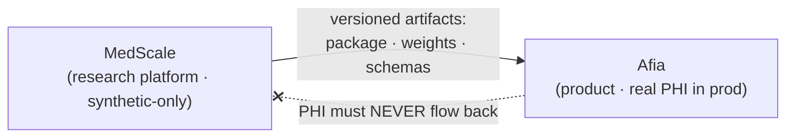

<!-- markdownlint-disable MD033 MD041 -->
<div align="center">

# MedScale

**Open research intelligence infrastructure for medicine.**

*Verifiable clinical AI and verified evidence · FHIR-native · validator-grounded · deterministic · reproducible*

[](https://github.com/TheHalfMoon/MESC/actions/workflows/ci.yml)
[](LICENSE)
[](pyproject.toml)
[](ROADMAP.md)

</div>

---

## What MedScale is

MedScale builds research infrastructure whose clinical outputs can be checked mechanically against explicit validators, schemas, and executable evaluation contracts rather than judged only by plausibility. The organizing bet is that, in medicine, **verifiable form and traceable content are worth more than fluent prose that cannot be checked.**

The platform is organized around five ideas:

| Idea | Current meaning |
|---|---|
| **FHIR-native** | FHIR is a first-class representation; a deterministic local validation boundary exists in `medscale.fhirkit`. |
| **Grammar-constrained generation** | Research direction, not a current release capability. FHIR grammar work remains separately gated. |
| **Validator-grounded verification** | Validation and explicit machine-checkable contracts are the verification boundary; external validator execution remains dependency/runtime constrained. |
| **Deterministic benchmarking** | `medscale.bench` provides deterministic benchmark contracts, scoring, artifacts, and replay surfaces; completion of the broader T3 research phase is not implied. |
| **Reproducible research** | Claims require committed scripts/artifacts and canonical evidence; negative results are first-class. |

The guiding scientific hypothesis remains: **grammar guarantees form; training only teaches content.** It is a hypothesis to test, not a present capability claim.

MedScale has two pillars on one verification spine ([ADR-0005](docs/adr/0005-research-intelligence-scope.md)): **verifiable clinical generation** and **verified evidence infrastructure**. It is research infrastructure — not a medical chatbot, and not a clinician-facing answer product.

> MedScale is **not** a from-scratch foundation model, **not** a medical device, and is
> **never** trained or evaluated on PHI. See
> [What MedScale is / is not](docs/vision/MEDSCALE_RESEARCH_VISION.md).

## MedScale and Afia

MedScale is an independent research platform. A separate product, **Afia**, consumes it. The dependency is strict and one-way:



**Afia depends on MedScale. MedScale must never depend on Afia.** Formalized in [ADR-0003](docs/adr/0003-repository-topology.md).

## Status

**Current package version: v0.2.0.** The repository contains deterministic literature/evidence infrastructure, benchmark contracts and execution surfaces, Dataset v1 contracts, a FHIR validation boundary, optional model-backend/runtime boundaries, reviewer collaboration workflows, and governed research-loop infrastructure.

Those implemented surfaces do **not** by themselves mean that every legacy T-phase is complete or that model execution, training, promotion, publication, or production deployment is authorized. In particular, FHIR grammar-constrained generation remains open, broader benchmark/research gates remain governed separately, and live MRL/Mission Zero evidence takes precedence over summary prose here. See the [Roadmap](ROADMAP.md).

The public package surface includes reproducibility primitives, literature database storage, review/screening workflows, evidence objects, deterministic benchmark/evaluation contracts, FHIR validation, model-interface/runtime boundaries, and governed MESC research infrastructure. Exact eligibility and completion claims must be established from canonical specifications and evidence, not inferred from module existence.

## Repository map

| Path | Contents |
|---|---|
| [`docs/vision/`](docs/vision/) | Strategic Blueprint (canonical narrative) + Research Vision (canonical scope) |
| [`docs/research/`](docs/research/) | Research questions, paper taxonomy, reproducibility policy |
| [`docs/governance/`](docs/governance/) | Program rules (R1–R7), policies |
| [`docs/adr/`](docs/adr/) | Architecture Decision Records |
| [`docs/execution/`](docs/execution/) | Execution and phase-planning documents |
| [`docs/archive/`](docs/archive/) | Superseded material retained for history |
| [`src/medscale/`](src/medscale/) | The `medscale` Python package |
| [`tests/`](tests/) | Test suite |

Start with the [Documentation Index](docs/README.md) and the [Glossary](docs/glossary.md).

## Quickstart (development)

MedScale uses [uv](https://docs.astral.sh/uv/) and Python 3.11+.

```bash
git clone https://github.com/TheHalfMoon/MESC MedScale
cd MedScale
uv sync
uv run pytest
uv run ruff check .
uv run mypy
```

See the [Developer Guide](docs/guides/developer_guide.md) for the full workflow.

## Contributing

MedScale welcomes contributors under its reproducibility and citation policies. Please read [CONTRIBUTING](CONTRIBUTING.md), the [Code of Conduct](CODE_OF_CONDUCT.md), and the [program rules R1–R7](docs/governance/rules.md) before opening a pull request.

## Citing MedScale

If you use MedScale in academic work, please cite it — see [CITATION.cff](CITATION.cff).

## License

[Apache-2.0](LICENSE). Everything MedScale ships is chosen to permit derivative models and commercial use, so that Afia — and others — may build on it.
