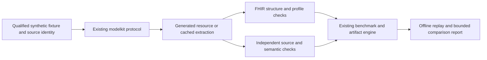

# MedScale implementation roadmap

- **Status:** Implementation planning; proposed targets, no experiment or release authority.
- **Date:** 2026-09-09.
- **Reviewed MedScale revision:** `ef5a70e86ff829efe52e042aaa37ce4bb8c418fe`.
- **Related:** [gap review](../architecture/openmed_gap_review_2026-09-09.md),
  [delivery backlog](implementation_backlog_2026-09-09.md),
  [performance-first program](../strategy/mesc_health_model_program_2026-09-05.md),
  [Experiment-0](../../specs/mesc-experiment-0/README.md).

## Outcome and scope

Make MedScale the research platform people choose when they need to reproduce an
evidence-grounded medical AI result, inspect its failures, and build on its artifacts.
Develop MESC toward independently demonstrated health-model quality under ADR-0036.
These are complementary outcomes: a useful toolkit can ship before a model wins.

The first complete workflow is a **synthetic English/Arabic note to a supported FHIR
bundle, source-span evidence, validation report, and replayable comparison artifact**.
A second workflow takes a frozen literature/evidence snapshot to a reproducible evaluation.
Neither workflow asserts clinical fitness. Structural validity cannot establish medical truth.

OpenMed is a serious extraction baseline and engineering reference. Beating it means a
measured advantage on a named overlapping task, with the comparator configured fairly.
MedScale-only research capabilities must be demonstrated separately, not scored as failures
for OpenMed. Model count, stars, document volume, and checkboxes are not success metrics.

This roadmap translates existing strategy into delivery units. It does not supersede
accepted ADRs, canonical specifications, R1–R7, existing public API stability, or evidence
authority. Proposed contract changes enter their applicable specs before implementation.
It introduces no new readiness flag and must not be consumed as execution authorization.

## Repository findings and delivery response

| Finding at reviewed revision | Consequence | Delivery response |
|---|---|---|
| `fhirkit` exports local validation/report boundaries; ROADMAP leaves FHIR grammar open | A validation API alone cannot deliver the flagship workflow | MS-03 delivers a small explicit supported grammar/profile subset and failure semantics |
| `GenerationRequest.grammar` and `SpanExtractor` already exist | Parallel interfaces would fragment the package | Reuse these protocols; preserve their frozen return types |
| `pyproject.toml` has no OpenMed extra; the registry has an OpenMed family entry | Registry presence does not provide the ADR-0007 adapter | MS-04 implements the optional baseline behind the existing protocol |
| Benchmark engine, deterministic scoring, and replay surfaces exist | Another benchmark framework would duplicate infrastructure | Extend the current engine through a versioned task/scorer contract |
| Experiment-0 status is preparation-only; MRL-0801–0808 remain separate gates | A model-training schedule cannot begin from module existence | MS-07 assembles missing evidence into the existing preflight path |
| September strategy is broad; July OpenMed analysis has stale facts/naming | Contributors can act on incompatible assumptions | Link this plan from existing entry points and mark historical comparison context |
| Research quickstart leads with literature screening | The AI verification value is hard to experience directly | MS-01 adds a separate synthetic verification walkthrough |

These are source and planning findings, not a full runtime audit. Absence of a capability
in reviewed files is not proof that no unreviewed implementation exists. Each task begins
with a bounded reuse check before adding code.

## Definition of success

The following are **proposed engineering/research targets**, not measured results, clinical
thresholds, or amendments to frozen experiments. MS-02 calibrates feasibility using development
data, then freezes the actual thresholds in the applicable contract before result exposure.

| Dimension | Proposed acceptance target | Evidence |
|---|---|---|
| First useful result | A new researcher completes the synthetic walkthrough within 15 minutes after environment setup; model-free path requires no credentials | Three independent walkthroughs with timings and failures; initial fixture path remains useful before GPU work |
| Reproducibility | Identical canonical scoring/replay hashes for identical frozen inputs across supported CI Python versions | Offline fixture CI; timestamps and machine telemetry outside identity core |
| FHIR engineering | Every accepted result passes the declared supported structural/profile checks; unsupported profiles and unavailable validators fail explicitly | Positive and negative fixtures plus a separately pinned external-validator lane |
| Semantic fidelity | Every populated clinical field has a source span or an explicitly allowed deterministic derivation | Field-level support ledger; unsupported-field rate; negation, units, temporality and subject tests |
| Shared extraction task | Target at least +2 absolute percentage points in exact span micro-F1 over the frozen OpenMed baseline, with lower paired 95% CI above zero | Same items and label map, three seeds, per-label results; failure to reach target is a valid result |
| Language quality | Report English, Arabic, and code-switched slices separately; proposed non-inferiority margin is 2 percentage points on each declared primary slice | Grouped confidence intervals; underpowered slices labeled inconclusive |
| Safety and abstention | No critical failure in the frozen synthetic sentinel suite; target unsupported-field rate at most 1% and report answer coverage | Report denominators, uncertainty, false abstentions, and all sentinel failures; zero observed failures is not proof of safety |
| Research usability | Two researchers outside the implementation author reproduce an artifact without private help | Versioned reproduction records and resolved documentation issues |
| Resource use | Record cold/warm latency, peak RAM/VRAM, load time and total run cost; quality precedes cost | Hardware and quantization identities, common workload, authorized spend ceiling |

For extraction, score exact `(start, end, label)` tuples against independent gold. Report
precision and recall alongside F1 so abstention cannot hide missed entities. End-to-end
FHIR quality is a separate task: an NER system without a FHIR interface is not assigned
an artificial zero. Compare NER-derived FHIR only through a documented common mapping layer.

Use three fixed seeds as R7 requires. Separate across-seed variation from sampling
uncertainty: bootstrap independent scenario/source groups, not correlated sentences or
translations. Use paired resampling with the same group draws for both systems. Report
per-seed scores and a predeclared group-bootstrap 95% interval on the paired mean difference.
For deterministic baselines, repeated seeds document stability rather than create independent
samples. Predeclare a primary metric; adjust secondary confirmatory comparisons (for example,
Holm correction) or mark them exploratory. If the difference is within seed variation or
uncertainty includes zero, report no demonstrated difference.

## Architecture of the first workflow

Keep acquisition, inference, deterministic scoring, and publication separate. Default demos
and CI replay recorded synthetic artifacts; a fixture result must identify itself as a
fixture. Real inference belongs behind qualified optional backends and existing MRL gates.
An offline run with a missing model/validator must fail with a named dependency error rather
than download silently. Provider or model output is never promoted to gold by being cached.

### Proposed contract details for MS-02 and MS-03

Extend existing artifacts through a versioned envelope or sidecar rather than modifying
frozen public dataclasses without the API policy:

- Identity: contract version, repository commit, input hash, synthetic-source generator
  revision and seed, source rights record, model/backend/quantization revisions, prompt,
  tokenizer, decoding parameters, grammar hash, validator and profile-package identities.
- Source mapping: offsets are half-open Unicode code-point indices into the exact original
  text; `text[start:end]` must equal the recorded span. Any normalization retains an explicit
  original-to-normalized mapping. Arabic diacritics, bidirectional text and mixed digits
  receive fixtures; UTF-8 bytes and UTF-16 indices must never be mistaken for code points.
- Field support: JSON pointer, source span IDs, allowed transformation ID, status
  `supported`, `unsupported`, or `not_assessed`. Labels, units and derivations use a frozen
  mapping; inference beyond the source remains unsupported unless separately adjudicated.
- Validation: distinguish JSON parse, resource schema, profile/invariant, reference integrity,
  and semantic checks. `not_run` and unavailable dependencies cannot become `pass`.
- Failure: record truncation, unsupported resource/profile, validator unavailable, malformed
  output, unresolved reference, unsupported content, and execution error separately. A partial
  output remains a failed item in the denominator. Do not repair outputs invisibly.
- Provenance: content-addressed result and replay inputs; environment metadata is explicit.
  Never place secrets, patient data, or sealed item content in public artifacts.

Initial proposed subset: FHIR R4 Patient, Condition, Observation and MedicationStatement
inside a collection Bundle, with synthetic identifiers and locally resolvable references.
Explicitly enumerate supported fields, cardinalities, code/value/unit behavior and profile
invariants in MS-03. Do not advertise full FHIR R4 support. Grammar enforces only its declared
syntax subset; an independent validator and semantic scorer remain mandatory boundaries.
Keep terminology interface-only where redistribution is restricted.

## Ordered milestones

Effort estimates are planning ranges in focused engineering days, excluding external review,
data qualification and compute waiting. One founder executes one task at a time under R4.
There is no promised calendar completion date or implicit compute allocation.

| Milestone | Tasks | Estimated effort | Exit artifact |
|---|---|---|---|
| A: usable research loop | MS-01, MS-02 | 7–12 days | Runnable synthetic example, versioned fixture/metric contract, independent gold procedure |
| B: defensible shared-task comparison | MS-03, MS-04, MS-05 | 15–25 days | Supported FHIR subset, optional OpenMed adapter, reproducible comparison harness |
| C: first qualified foundation evidence | MS-06, MS-07 | 8–15 engineering days plus external dependencies | English/Arabic development suite and genuine Experiment-0 preflight evidence |
| D: bounded model improvement | MS-08 | 10–20 days after eligibility | Ground-truth SFT pilot with untuned/retrieval/constraint controls or a null result |
| E: independently reproducible release | MS-09 | 4–7 days plus review | Toolkit release candidate and separately qualified model candidate, if earned |
| Later modality expansion | MS-10 | Re-estimate after D | One modality-specific proposal at a time |

Critical path: MS-01 → MS-02 → MS-03 → MS-05 → MS-07 → MS-08 → MS-09.
MS-04 and MS-06 feed MS-05/MS-07 as specified in the backlog. External blockers do not
prevent model-free fixture and toolkit work. Milestone C reuses Experiment-0; it does not
create a competing tournament. No multimodal teacher generation is scheduled before the
text/evidence loop establishes value.

## Data, evaluation and operational decisions

Start with hand-authored and qualified synthetic fixtures only. Split by source/scenario
family before augmentation; translations and near-duplicates stay together. Include
negation, uncertain diagnoses, family history versus patient findings, missing dates,
contradictory facts, unit changes, repeated identifiers, empty input, long input and Arabic
code-switching. Model-generated examples need independent validation before admission.

The September strategy mentions rights-qualified public/de-identified sources while R2
states synthetic-only. Do not interpret broad strategy prose as blanket admission: every
non-synthetic asset must reference its applicable accepted scope decision and exact rights
qualification; unresolved conflict blocks that asset. This plan uses synthetic data and
does not change those decisions. Synthetic-only scores support synthetic-task claims;
general medical or clinical superiority requires separately eligible representative evidence.

Model choice remains open until Experiment-0. Historical preferred candidates must be
rechecked against official immutable artifacts during MRL-0801; this plan does not refresh
or endorse their current availability, licensing, or performance. Compare the untuned base,
base plus retrieval, base plus constraints, and later ground-truth SFT using the same frozen
task distribution. Attribute gains to the intervention rather than a changed prompt or corpus.

Freeze number of candidates, examples per lane, context/output limits, repetitions, timeouts,
retry policy and storage budget. Compute estimate is measured pilot throughput multiplied
by the frozen workload plus an explicit contingency. A runtime owner proposes a maximum
currency spend and GPU-hour limit for the existing authorization record; unset limits block
paid execution. Capacity failures are runtime dispositions, not scientific model losses.

Stop a run on identity mismatch, unexpected network use in an offline lane, contamination,
unqualified assets, exhausted exposure/spend budget, or a critical sentinel failure. Preserve
permitted diagnostic evidence, revoke the candidate result, and return to the responsible
task. Do not retune on sealed failures. Unexpected regressions reopen development evaluation
under a new campaign identity; old evidence stays immutable.

## Keeping implementation focused

Every task must produce a usable example, testable behavior or real decision evidence. Do not
add a governance layer when the existing MRL/training contracts already represent the need.
Before adding a module, identify the existing extension point and why it cannot suffice.
Keep core installation dependency-free; qualified optional backends must stay optional.

At each milestone review record: delivered artifact, measured user outcome, failed hypotheses,
remaining external blocker, next single task, actual effort and revised estimate. If two
bounded development iterations fail to improve the targeted error class, stop expanding that
intervention and publish the null result. Reprioritize using failure evidence.

The immediate next unit is **MS-01**. The detailed backlog below this roadmap contains the
inputs, owner role, changed surfaces, verification and closeout expectations for each unit.
