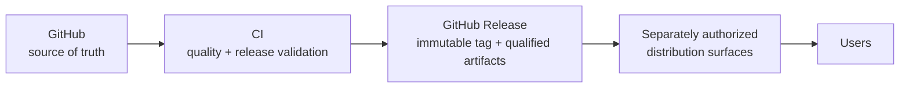

# Releases — Publication & Artifact Lifecycle

- **Status:** Binding strategy governed by
  [ADR-0010](../adr/0010-release-architecture.md) and
  [ADR-0011](../adr/0011-versioning-licensing.md), both **Accepted**
- **Original design date:** 2026-07-10
- **Governance reconciliation:** 2026-09-03

This section defines how every MedScale artifact is versioned, licensed, validated,
released, distributed, deprecated, and — if ever necessary — retracted. It exists so
that publication is a *governed pipeline*, not an event.

## The canonical flow (never the reverse)

- **GitHub is the only source of truth.** Every published artifact traces to governed
  repository identity and the applicable release/tag evidence.
- **External surfaces are distribution only.** Nothing originates there; a mirror or
  package index entry that drifts from its source release is a defect.
- **CI is the only publisher.** Manual external uploads are prohibited; each external
  distribution path must have its own qualified CI automation and operator gate
  ([ci_cd.md](ci_cd.md)).
- **Current implementation is partial.** `.github/workflows/release.yml` implements
  package build/GitHub Release automation and exact-artifact qualification. TestPyPI,
  PyPI, and Hugging Face publication remain separately gated and are not implemented
  by accepting the release ADRs.

## Principles

1. **Released = immutable.** A version, once published, never changes; fixes are new
   versions ([versioning.md](versioning.md)).
2. **No artifact without the applicable reproducibility record.** Release evidence is
   governed by [reproducibility.md](reproducibility.md) and the artifact-specific gate.
3. **No artifact without a gate.** Each class has release criteria and a checklist
   ([release_process.md](release_process.md)); an artifact that fails its gate does not
   ship, whatever the calendar says.
4. **Licence before bytes** (Rule R3): licence review precedes publication, per field
   where required ([licensing.md](licensing.md)).
5. **Retraction is visible, not silent** — artifacts are marked and superseded, never
   silently deleted.

## Documents

| Document | Covers |
|---|---|
| [artifact_lifecycle.md](artifact_lifecycle.md) | Every artifact class, its states and gates |
| [versioning.md](versioning.md) | Binding version schemes for package, models, datasets, benchmarks, schemas, docs, ADRs |
| [release_process.md](release_process.md) | The release procedure + all checklists (incl. deprecation, retraction) |
| [distribution.md](distribution.md) | GitHub Releases + separately governed distribution surfaces |
| [licensing.md](licensing.md) | Binding per-artifact licensing matrix, inheritance, citation requirements |
| [model_cards.md](model_cards.md) | Required model-card content |
| [dataset_cards.md](dataset_cards.md) | Required dataset-card content |
| [benchmark_publication.md](benchmark_publication.md) | Benchmark spec, immutability, leaderboard policy |
| [papers.md](papers.md) | Research → paper → replication-package workflow |
| [reproducibility.md](reproducibility.md) | Release reproducibility/evidence requirements |
| [ci_cd.md](ci_cd.md) | Current package/GitHub-Release automation and separately gated future distribution paths |
